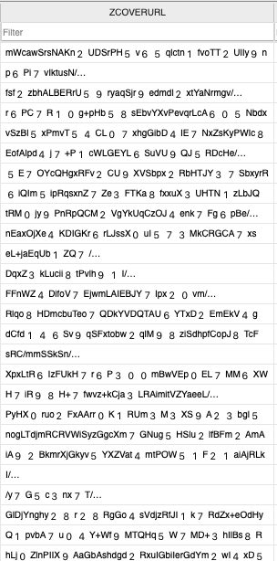

# HyRead
  

HyRead, access your book collection both online and offline, while marking your favorite reads anytime, anywhere.

 

**[INTRODUCTION](https://github.com/r1ddx2/HyRead_/blob/main/README.md#-introduction) • 
[REQUIREMENTS](https://github.com/r1ddx2/HyRead_/blob/main/README.md#%EF%B8%8F-requirements) •   
[TECH IMPLEMENTATION](https://github.com/r1ddx2/HyRead_/blob/main/README.md#-tech-implementation) • 
[TECH STACK](https://github.com/r1ddx2/HyRead_/blob/main/README.md#-tech-stack) • 
[AUTHOR](https://github.com/r1ddx2/HyRead_/blob/main/README.md#-author) • 
[LICENSE](https://github.com/r1ddx2/HyRead_/blob/main/README.md#-license)**

 

## 💡 Introduction

- View user's book list online or offline
- Mark books as your favorite and view in your collection

 

<table>
  <tr align="center">
    <td>My Books Page</td>
     <td>My Favorites Page</td>
  </tr>
  <tr>
    <td></td>
    <td></td>
  </tr>
 </table>

 

## ⚙️ Requirements
- iOS 16.0+

## 📲 Tech Implementation
- Implemented the **MVVM** architecture along with **Combine** framework for reactive programming.
- Used **Core Data** for persistent storage, ensuring consistent access both online and offline.
- Utilized **CryptoKit** to encrypt the sensitive data stored in **Core Data**, ensuring enhanced security.
- Employed **Keychain** to securely store the key used for **CryptoKit** encryption.

 

<table>
  <tr align="center">
    <td>Encrypted Local Data</td>
  </tr>
  <tr>
    <td></td>
  </tr>
 </table>

 

  
## 📐 Tech Stack
- [UIKit](https://developer.apple.com/documentation/uikit/) - Construct and manage a graphical, event-driven user interface for your iOS, iPadOS, or tvOS app.
- [Combine](https://developer.apple.com/documentation/combine) - Customize handling of asynchronous events by combining event-processing operators.
- [Core Data](https://developer.apple.com/documentation/coredata) - Persist or cache data on a single device, allowing offline access.
- [CryptoKit](https://developer.apple.com/documentation/cryptokit/) - Perform cryptographic operations securely and efficiently.
- [Keychain services](https://developer.apple.com/documentation/security/keychain_services/)) - Securely store small chunks of data on behalf of the user.
- [Kingfisher](https://github.com/onevcat/Kingfisher) - Downloading and caching images from the web.
- [SwiftLint](https://github.com/realm/SwiftLint) - A tool to enforce Swift style and conventions.

## 👨🏻‍💻 Author
 **Red Wang**
* Email: [red0wang9@gmail.com]()
* Linkedin: [Red Wang](https://www.linkedin.com/in/red-wang-19a49623a/)
* GitHub: [@r1ddx](https://github.com/r1ddx2)

## 📝 License

Copyright © 2023 [Red Wang](https://github.com/r1ddx2). 
This project is [MIT](https://github.com/r1ddx2/InTouch/blob/main/LICENSE) licensed.
